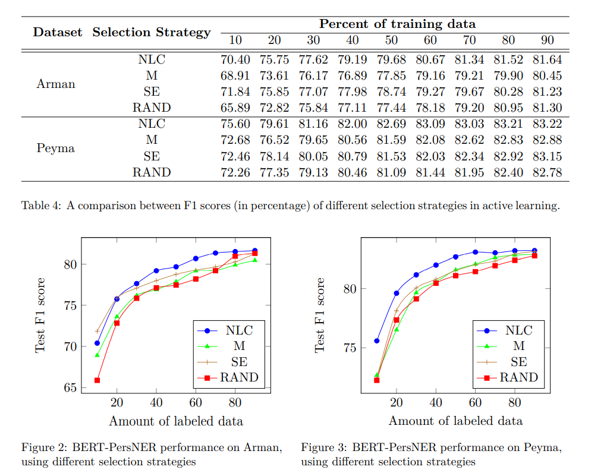

# BERT-PersNER: a New Model for Persian Named Entity Recognition

This repository contains the code for [BERT-PersNER: a New Model for Persian Named Entity Recognition](https://faranejalalifarahani.github.io/files/bert-persner.pdf). The paper introduces a new model called BERTPersNER (BERT based Persian Named Entity Recognizer), in which the authors have applied transfer learning and active learning approaches to NER in Persian, which is regarded as a low-resource language. BERT-PersNER has outperformed two available studies in Persian NER, in most cases of experiments. 

# Requirements

`python3`

`pip install -r requirements.txt`

# Run

`python run_<selection_strategy_name>.py --data_dir=./input  --output_dir=./output --bert_model_scale="bert-base-multilingual-cased" --batch_size=8 --learning_rate=5e-5 --max_seq_length=180`

# Reported scores for different selection strategies

