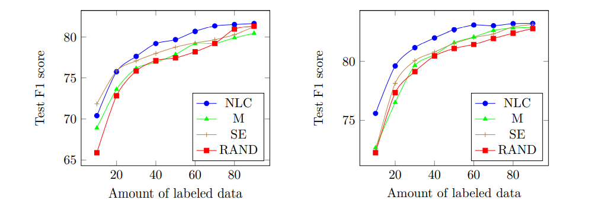

# BERT-PersNER: a New Model for Persian Named Entity Recognition

This repository contains the code for [BERT-PersNER: a New Model for Persian Named Entity Recognition](https://faranejalalifarahani.github.io/files/bert-persner.pdf). The paper introduces a new model called BERTPersNER (BERT based Persian Named Entity Recognizer), in which the authors have applied transfer learning and active learning approaches to NER in Persian, which is regarded as a low-resource language. BERT-PersNER has outperformed two available studies in Persian NER, in most cases of experiments. 

# Citation

```
@inproceedings{jalali-farahani-ghassem-sani-2021-bert,
    title = "{BERT}-{P}ers{NER}: A New Model for {P}ersian Named Entity Recognition",
    author = "Jalali Farahani, Farane  and
      Ghassem-Sani, Gholamreza",
    booktitle = "Proceedings of the International Conference on Recent Advances in Natural Language Processing (RANLP 2021)",
    month = sep,
    year = "2021",
    address = "Held Online",
    publisher = "INCOMA Ltd.",
    url = "https://aclanthology.org/2021.ranlp-main.73",
    pages = "647--654"
}
```

# Input Format

Input format (IOB tag scheme), with each token its label for one line. Sentences are separated with a null line.

```
موافقت O
ایران B-loc
با O
همکاری O
چین B-loc
در O
حفاری O
میدانهای O
گاز O
. O

این O
اولین O
قرارداد O
میان O
شرکت B-org
ملی I-org
نفت I-org
چین I-org
با O
ایران B-loc
از O
هنگام O
پیروزی O
انقلاب O
اسلامی O
است O
. O
```

# Requirements

```
python3
```

```
pip install -r requirements.txt
```

# Run

```
python run_<selection_strategy_name>.py --data_dir=./input  --output_dir=./output --bert_model_scale="bert-base-multilingual-cased" --batch_size=8 --learning_rate=5e-5 --max_seq_length=180
```

# A comparison between different selection strategies

BERT-PersNER performance on Arman (left) and Peyma (right), using different selection strategies.



